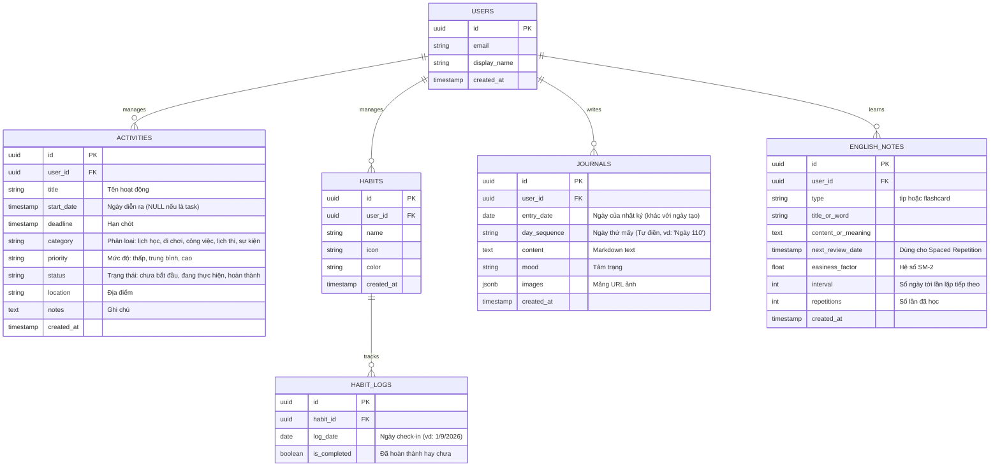
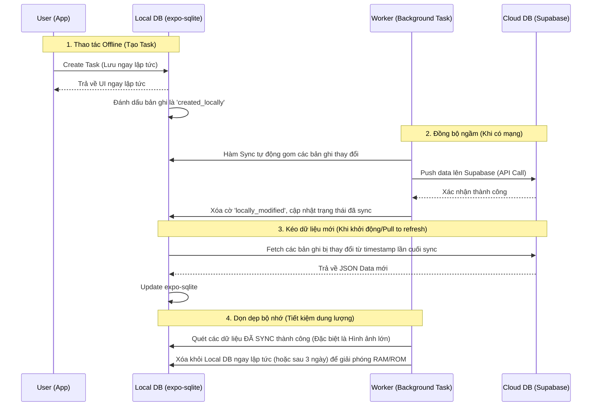

# Kiến trúc Hệ thống Dự án EtoDo

Tài liệu này mô tả chi tiết về mặt kỹ thuật, cấu trúc thư mục, luồng dữ liệu (Data Flow) và thiết kế Cơ sở dữ liệu (Database Schema) cho ứng dụng EtoDo.

## 1. Tổng quan Kiến trúc (Tech Stack)

*   **Frontend Mobile & Web:** React Native (Framework), Expo (Toolchain/Build system).
*   **Styling:** NativeWind (Sử dụng utility classes của Tailwind CSS).
*   **State Management:** Zustand (Quản lý Global state nhẹ, nhanh, không boilerplate).
*   **Local Database (Offline-first):** expo-sqlite (Database quan hệ nội bộ tiêu chuẩn của Expo, hoạt động trơn tru trên Expo Go).
*   **Backend as a Service (BaaS):** Supabase (PostgreSQL, Authentication, Storage).
*   **Routing/Navigation:** Expo Router (File-based routing, giúp quản lý chuyển trang giống hệt Next.js).

## 2. Cấu trúc Thư mục (Folder Structure)

Sử dụng cấu trúc hướng tính năng (Feature-based) kết hợp với mô hình chuẩn của Expo Router:

```text
EtoDo/
├── assets/                 # Chứa hình ảnh, fonts, icons tĩnh
├── src/                    # Chứa toàn bộ source code chính
│   ├── components/         # Các UI component dùng chung (Button, Card, Input)
│   ├── features/           # Chia theo từng module tính năng
│   │   ├── activities/     # (Tasks, Events) - Components, logic riêng
│   │   ├── habits/         # (Habits)
│   │   ├── journal/        # (Journals)
│   └── database/           # Chứa schema và queries của expo-sqlite
│   ├── services/           # Chứa logic gọi API (Supabase Client), hàm Sync data
│   ├── store/              # Global state (Zustand - quản lý user auth, theme)
│   ├── utils/              # Các hàm helper dùng chung (format ngày tháng, thuật toán SM-2)
│   └── constants/          # Khai báo hằng số (Colors, Configs)
├── app/                    # Thư mục xử lý Routing (Của Expo Router)
│   ├── (tabs)/             # Các màn hình nằm trong Bottom Tab
│   │   ├── index.tsx       # Màn Dashboard (Activities)
│   │   ├── habits.tsx      # Màn Habits
│   │   ├── journal.tsx     # Màn Nhật ký
│   │   └── english.tsx     # Màn Tiếng Anh
│   └── _layout.tsx         # Khung layout chung của app
├── .env                    # Biến môi trường (Supabase URL, Anon Key)
├── tailwind.config.js      # Cấu hình NativeWind (Tailwind CSS)
└── app.json                # Cấu hình chung của Expo (Tên app, icon, permissions)
```

## 3. Thiết kế Cơ sở dữ liệu (Database Schema)

Hệ thống sử dụng cơ sở dữ liệu quan hệ (PostgreSQL trên Supabase). expo-sqlite ở Local cũng sẽ map 1-1 với cấu trúc này.



## 4. Luồng Dữ liệu Đồng bộ (Offline-first Data Flow)

Ứng dụng ưu tiên đọc và ghi vào Local DB (expo-sqlite) để đảm bảo tốc độ phản hồi ngay lập tức (0 độ trễ).



## 5. Kiến trúc Tự động hóa (Automation & Background Logic)

*   **Thời điểm kích hoạt:** Trigger mỗi khi người dùng mở App (App is foregrounded) hoặc thiết lập Expo Background Fetch.
*   **Logic xử lý (Local Utils):**
    1.  Lấy ngày hiện tại `Today`.
    2.  Kiểm tra ngày mở app gần nhất (`Last_Opened_Date` lưu trong AsyncStorage).
    3.  Nếu `Today` > `Last_Opened_Date`:
        *   Quét bảng `Activities`: Tìm các record có `deadline < Today` & `status != hoàn thành` $\rightarrow$ Đổi `status = hoàn thành` (áp dụng cho các hoạt động tự động hoàn thành).
        *   Quét bảng `Habits`: Đảm bảo `HabitLogs` cho ngày `Today` được tạo mặc định là `false`.
    4.  Cập nhật lại `Last_Opened_Date = Today`.
    5.  Sau khi áp dụng logic ở Local DB, một hàm sync tùy chỉnh sẽ đẩy những thay đổi này lên Supabase.
